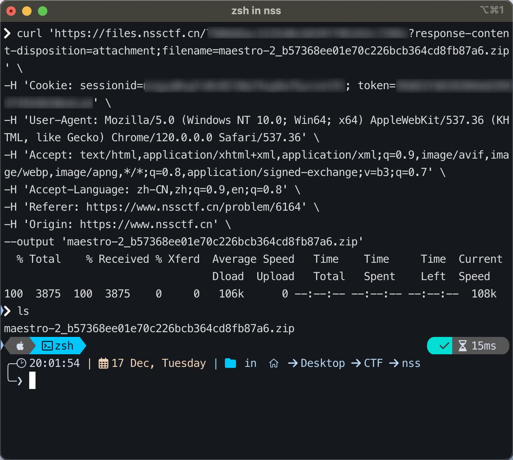

# nss-curl

一个简单的 Chrome 扩展，用于生成 NSSCTF 题库附件的 curl 下载命令  
A simple Chrome extension for generating curl download commands for NSSCTF attachment files.

  


## 安装方法 / Installation

1. 克隆本仓库到本地  
   Clone this repository to your local machine:

    ```bash
    git clone https://github.com/Threonine/nss-curl.git
    ```

2. 在 Chrome 浏览器中：  
   In Chrome browser:
    - 打开 `chrome://extensions/`  
      Open `chrome://extensions/`
    - 开启右上角的"开发者模式"  
      Enable "Developer Mode" in the top-right corner
    - 点击"加载已解压的扩展程序"  
      Click "Load unpacked"
    - 选择项目文件夹  
      Select the project folder

## 使用方法 / Usage

1. 访问 NSSCTF 的题目页面  
   Visit the problem page on NSSCTF
2. 开启题目环境  
   Start the problem environment
3. 刷新页面  
   Refresh the page
4. 如果插件加载成功，「附件下载」按钮将变为「附件下载(curl)」  
   If the extension loads successfully, the "附件下载" button will change to "附件下载(curl)"
5. 点击「附件下载(curl)」按钮  
   Click the "附件下载(curl)" button
6. 复制生成的 curl 命令  
   Copy the generated curl command
7. 在终端中使用命令下载附件  
   Use the command in the terminal to download the attachment

---

本项目仅供学习交流使用  
This project is for learning and communication purposes only.
